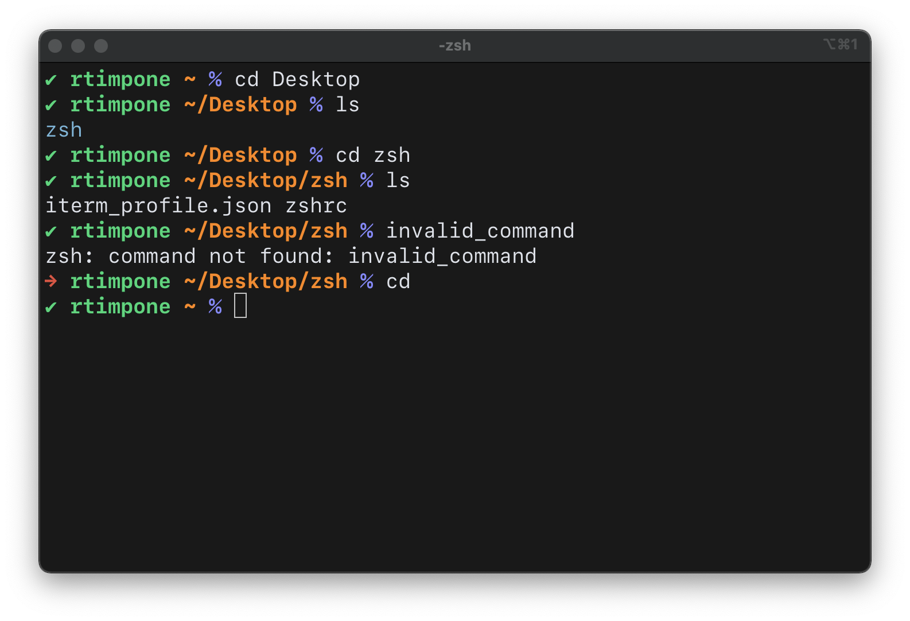

# iTerm Settings

These are the settings I use in the terminal app [iTerm 2](https://iterm2.com), as well as a basic .zshrc file I use for zsh. The settings I use are relatively simple - just a custom prompt, some color schemes, and case-insensitive tab completion. 

## iTerm Profile

Load this profile into iTerm to get the color scheme, font, and block cursor settings I use. I use the SF Mono font from Apple, so if you don't already have that installed, you'll need to download it [from Apple's font website](https://developer.apple.com/fonts/). 

## zshrc File 

Put the contents of this file into your .zshrc to use the custom prompt, ls alias, and autocompletion settings I use for zsh. 
